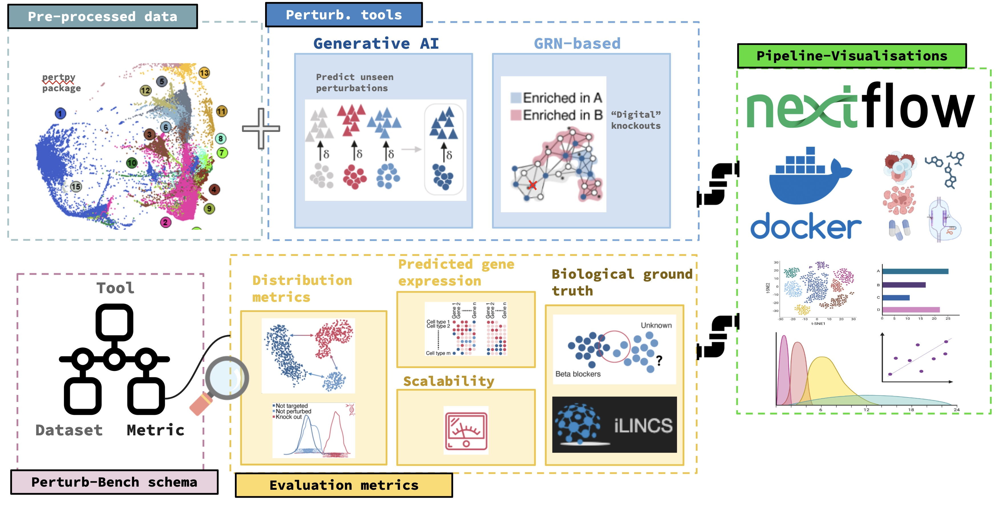

 # PerturbBench
### Welcome to the PerturbBench project of the BioHackathon Europe 2024!

## Overview
The **Perturb-Bench Project** focuses on assessing the robustness of single-cell perturbation modelling tools by developing a unified benchmarking pipeline that enables fair comparison. Many publications report only on metrics that favour their own tools. The Perturb-Bench project is a collective effort to provide an objective and systematic comparison of these tools across a comprehensive set of metrics, offering a balanced overview of each tool’s capabilities.

To begin, we aim to:

- **Assess Extrapolation Accuracy**: Evaluate how closely the predictions of generative AI (GAI) tools designed to extrapolate unseen events align with ground truth data.

- **Evaluate Digital Knockout Performance**: Investigate the performance of Gene Regulatory Network inference (GRNs) tools conducting digital knockouts by comparing their results to experimental data, such as CRISPR screening outcomes.

## Objectives

- **Benchmarking Robustness:** Establish standardized benchmarks to measure methods robustness across diverse metrics, system distributions and datasets.
- **Tool Development:** Create a Nextflow framework to facilitate the testing and evaluation systematically.
- **Community Collaboration:** Engage with the ELIXIR research community to combine multidisciplinary, share findings, methodologies, and best practices.

## Schemas

These schemas formalize the methods flows through which Perturb-Bench will effectively compare GAIs and GRNs, ensuring consistent formats for data and results. For instance, common file formats like AnnData objects for sc-expression data/metadata will be required to be fed into metric functions across different scenarios.

### **Schema 1: GAI (Perturbation Task: Extrapolation to Unseen Events)**

**Workflow:**

1. Load the dataset.  
2. Pre-process the data (clarify specific pre-processing steps).  
3. Train and test the model:  
   - Activate the model instance.  
   - Perform hyperparameter tuning.  
   - Train the model.  
4. Generate predictions for control and stimulated scenarios (output as AnnData objects).  

**Outputs:**

- **R² Score**: Measures the closeness of predictions to stimulation data distributions.  
- **Distance Metrics**: Includes Euclidean distance, E distance, Maximum Mean Discrepancy, etc.  

---

### **Schema 2: GRN (Perturbation Task: Digital Knockout)**

**Workflow:**

1. Load the dataset.  
2. Pre-process the data (clarify specific pre-processing steps).  
3. Reconstruct the Gene Regulatory Network (GRN).  
4. Define the target for simulation.  
5. Optionally, specify the cell type for simulation.  

**Outputs:**

- **KO-Responsive Genes**: A list of genes responsive to knockouts.  
- **Validation Metric**:  
  - Compare results against iLINCS ground truth using Jaccard Similarity.  
  - Optionally, validate with other experimental perturbation datasets.

##### If you are a participant, please check our guide and do not hesitate to get in contact with us if needed: https://docs.google.com/document/d/1Kp7-LJOEpZaBdUOM_cBLXfu7nC7mcRi0XrMTsDgN6Go/edit?usp=sharin

